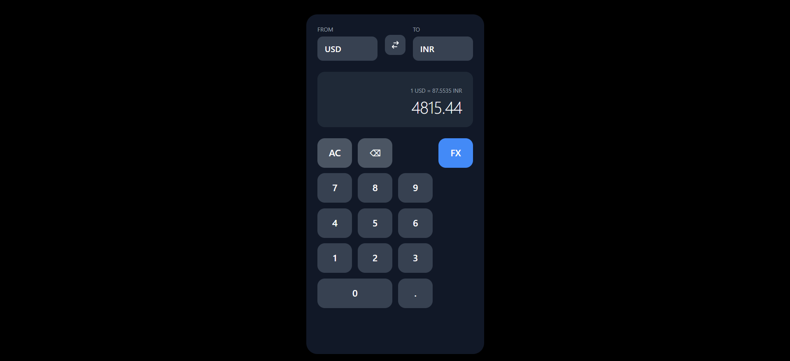
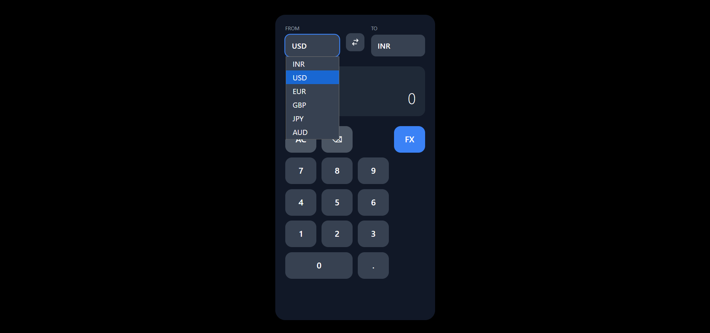
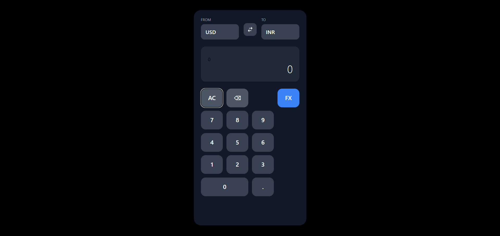

# iOS Calculator - Currency Converter

A iOS-style calculator that doubles as a currency converter. Built using **React** for the frontend and **Node.js + Express** for the backend.

---

## 🖥️ Tech Stack

### Frontend
- **React**
- **Tailwind CSS** 
- **Axios** (for API calls)

### Backend
- **Node.js**
- **Express**
- **Currency API** (exchangeratesapi.io)

---

## 🚀 Getting Started

### 1. Clone the Repository
### 2. Create env files for frontend and backend

## Backend
``` bash
PORT = 5000
API_KEY = your exchangeapirates api key
```

## Frontend
``` bash
BACKEND = http://localhost:5000
```


### 3. Install Dependencies (Frontend)
```bash
npm i
npm run start
```

### 4. Install Dependencies backend
```bash
cd backend
npm i
nodemon index.js
```

### Screenshots





